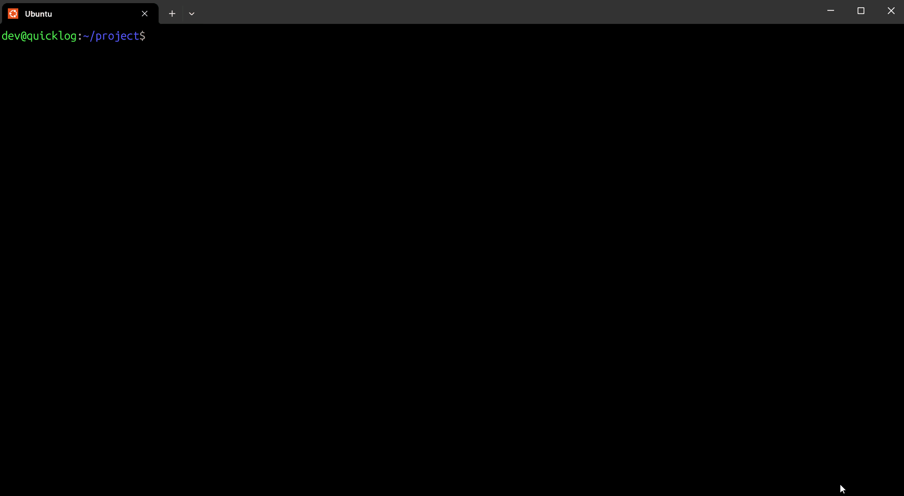

# Git QuickLog


**Git QuickLog** è un tool CLI (Command Line Interface) avanzato scritto in Python per esplorare la cronologia dei repository Git.

A differenza del comando nativo `git log`, QuickLog offre un'interfaccia **colorata**, **tabellare** e **altamente leggibile**, pensata per sviluppatori che vogliono analizzare rapidamente il proprio codice senza ricordare comandi complessi.




## Funzionalità Principali

*  **Interfaccia TUI:** Visualizzazione pulita con tabelle e colori (grazie alla libreria `rich`).
*  **Filtri Avanzati:** Filtra per Autore, Data, Messaggio (Grep) e Percorso file.
*  **Diff Viewer:** Visualizza le differenze di codice con syntax highlighting direttamente nel terminale (`--show`).
* **Cross-Platform:** Funziona perfettamente su GNU/Linux, Windows e macOS.

## 📦 Installazione

### Prerequisiti
* Python 3.9 o superiore [https://www.python.org/downloads/](https://www.python.org/downloads/)
* Git installato nel sistema [https://git-scm.com/downloads](https://git-scm.com/downloads)

### Installazione Rapida
1.  Clona il repository:
    ```bash
    git clone [https://github.com/TUO-USERNAME/git-quicklog.git](https://github.com/TUO-USERNAME/git-quicklog.git)
    cd git-quicklog
    ```

2. Configura l'Ambiente Virtuale (Consigliato)

È buona norma isolare le dipendenze del progetto creando un ambiente virtuale.

Su Windows:

 ```Bash

# Crea l'ambiente
python -m venv .venv

# Attiva l'ambiente
.\.venv\Scripts\activate 
```
Su GNU/Linux e macOS:

```Bash

# Crea l'ambiente
python3 -m venv .venv

# Attiva l'ambiente
source .venv/bin/activate
```
3. Installa il tool

Una volta attivato l'ambiente virtuale, installa il pacchetto in locale:

```Bash
pip install .
```
Nota per Sviluppatori: Se vuoi modificare il codice e vedere le modifiche in tempo reale, usa pip install -e .
## Utilizzo

Una volta installato, puoi digitare `quicklog` in **qualsiasi cartella** del tuo computer.

### Comandi Base
```Bash
# Visualizza gli ultimi 10 commit
quicklog

# Visualizza il menu di aiuto grafico
quicklog --help

# Cerca commit specifici
quicklog --author "Salvatore" --grep "fix"

```
## 📚 Documentazione Completa

Vuoi scoprire tutti i comandi, i filtri avanzati e i trucchi?

👉 **[LEGGI LA GUIDA UTENTE COMPLETA](docs/USER_GUIDE.md)**

